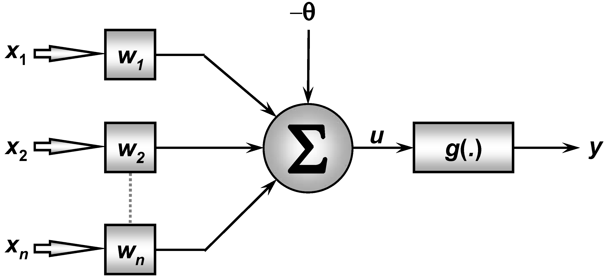

# 3.6 Perceptron — Projeto prático
Pela análise de um processo de destilação fracionada de petróleo observou-se que determinado óleo poderia ser classificado em duas classes de pureza {P1 e P2} a partir da medição de três grandezas {x1, x2, x3}, que representam algumas de suas propriedades físico-químicas. A equipe de engenheiros e cientistas pretende usar urna rede Perceptron para executar a classificação automática das duas classes. Assim, baseado nas informações coletadas do processo, formou-se o conjunto de treinamento apresentado no apêndice I, tomando por convenção o valor -1 para óleo pertencente à classe P1 e o valor 1 para óleo pertencente à classe P2. Para tanto, o neurônio constituinte do Perceptron terá então três entradas e uma saída conforme ilustrado na figura abaixo.

**Figura 1: Arquitetura do Perceptron para o projeto prático**

## Implementação

Utilizando o algoritmo supervisionado de Hebb (regra de Hebb) para classificação de padrões, e
assumindo-se a taxa de aprendizagem como 0,01, faça as seguintes atividades:

1) Execute cinco treinamentos para a rede Perceptron, iniciando o vetor de pesos {w} em cada
treinamento com valores aleatórios entre zero e um. Se for o caso, reinicie o gerador de
números aleatórios em cada treinamento de tal forma que os elementos do vetor de pesos
iniciais não sejam os mesmos. O conjunto de treinamento encontra-se no [anexo](anexo).

2) Registre os resultados dos cinco treinamentos na tabela apresentada a seguir

**Tabela 1 — Resultados dos treinamentos do Perceptron**

| Treinamento | w0     | w1     | w2     | w3     | w0 (Final) | w1 (Final) | w2 (Final) | w3 (Final) | Número de Épocas |
|-------------|--------|--------|--------|--------|------------|------------|------------|------------|:-----------------:|
| T1          | 0.1032 | 0.4904 | 0.0355 | 0.6717 | 1.6764     | 2.3343     | -0.7489    | -0.6483    |        78         |
| T2          | 0.4637 | 0.4057 | 0.8416 | 0.4944 | 1.6556     | 2.4297     | -0.7528    | -0.7456    |        97         |
| T3          | 0.3191 | 0.8163 | 0.6408 | 0.8110 | 1.6743     | 2.3691     | -0.7515    | -0.4090    |        76         |
| T4          | 0.1765 | 0.2270 | 0.4422 | 0.1300 | 1.6925     | 2.2959     | -0.7470    | -1.2100    |        89         |
| T5          | 0.5376 | 0.6439 | 0.7499 | 0.9535 | 1.6856     | 2.3316     | -0.7490    | -0.1865    |        85         |

3) Após o treinamento do Perceptron, coloque este em operação, aplicando-o na classificação
automática das amostras de óleo da tabela 1.2, indicando ainda nesta tabela aqueles
resultados das saídas (Classes) referentes aos cinco processos de treinamento realizados no
item 1.

**Tabela 1.2 — Amostras de óleo para validar a rede Perceptron**

| Amostra | x1      | x2      | x3      | Y(T1) | Y(T2) | Y(T3) | Y(T4) | Y(T5) |
|---------|---------|---------|---------|------|------|------|------|------|
| 1       | -0.3665 | 0.0620  | 5.9891  | -1   | -1   | -1   | -1   | -1   |
| 2       | -0.7842 | 1.1267  | 5.5912  | +1   | +1   | +1   | +1   | +1   |
| 3       | 0.3012  | 0.5611  | 5.8234  | +1   | +1   | +1   | +1   | +1   |
| 4       | 0.7757  | 1.0648  | 8.0677  | +1   | +1   | +1   | +1   | +1   |
| 5       | 0.1570  | 0.8028  | 6.3040  | +1   | +1   | +1   | +1   | +1   |
| 6       | -0.7014 | 1.0316  | 3.6005  | +1   | +1   | +1   | +1   | +1   |
| 7       | 0.3748  | 0.1536  | 6.1537  | -1   | -1   | -1   | -1   | -1   |
| 8       | -0.6920 | 0.9404  | 4.4058  | +1   | +1   | +1   | +1   | +1   |
| 9       | -1.3970 | 0.7141  | 4.9263  | -1   | -1   | -1   | -1   | -1   |
| 10      | -1.8842 | 0.2805  | 1.2548  | +1   | +1   | +1   | +1   | +1   |

